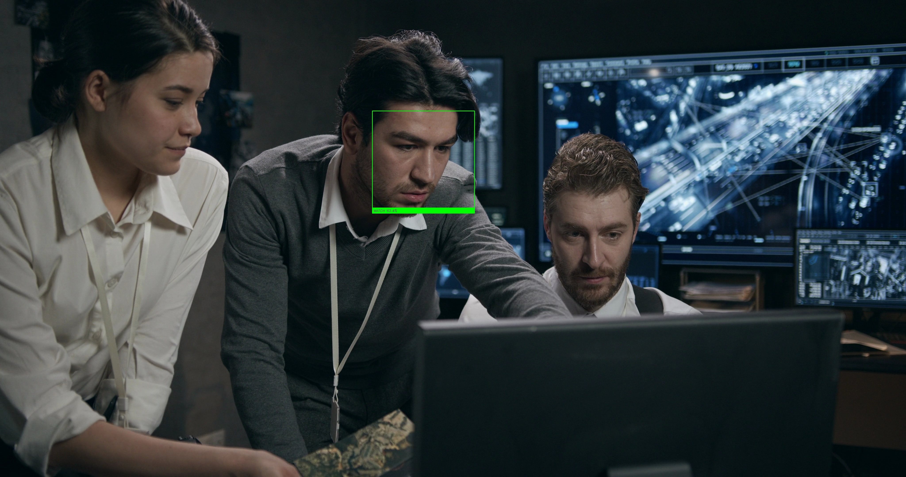
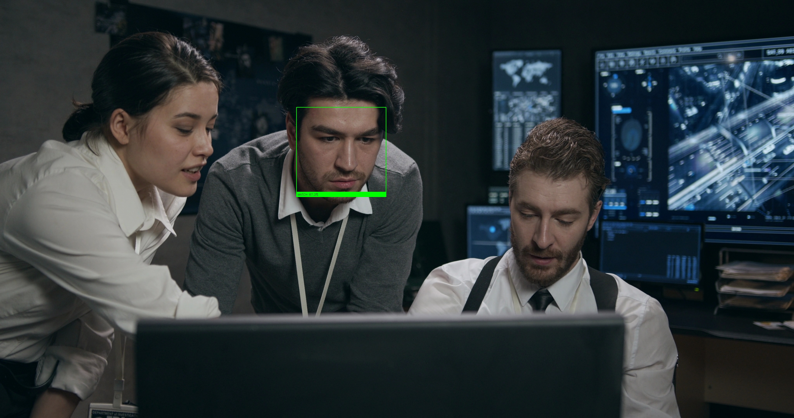

# 🔍 Facial Recognition System for Missing Persons

<div align="center">


**A powerful web-based facial recognition system to help locate missing persons in CCTV footage**

[Features](#-features) • [Demo](#-demo) • [Quick Start](#-quick-start) • [Usage](#-usage) • [Deployment](#-deployment) • [Contributing](#-contributing) • [License](#-license)

<p align="center">
  <a href="#-demo">View Demo</a> •
  <a href="https://github.com/yourusername/facial-recognition-system/issues">Report Bug</a> •
  <a href="https://github.com/yourusername/facial-recognition-system/issues">Request Feature</a>
</p>

</div>

---

## 📋 Overview

This application provides an intuitive dashboard for law enforcement, security personnel, and organizations to identify missing persons in video footage using state-of-the-art facial recognition technology.

### 🎯 Key Features

- **🖼️ Photo Upload**: Upload a clear photo of the missing person
- **🎥 Video Processing**: Analyze CCTV footage automatically
- **🎯 High Accuracy**: Uses deep learning-based face recognition (99.38% accuracy)
- **⚡ Fast Processing**: Optimized to process videos efficiently
- **📊 Visual Results**: See all matches with timestamps and confidence scores
- **🎨 Modern UI**: Clean, intuitive dashboard design
- **🔒 Privacy-Focused**: All processing happens on your server

## 🎬 Demo

### Target Photo Upload
Upload a clear photo of the person you're searching for:

<div align="center">
  
  <p><em>Example: Target person photo</em></p>
</div>

### Detection Results
The system analyzes video footage and identifies matches with high accuracy:

<div align="center">
  
  <p><em>Detection at 4.00s - Person identified with confidence score</em></p>
</div>

<div align="center">
  
  <p><em>Detection at 8.00s - Multiple frames showing the same person</em></p>
</div>

### Features Shown
- ✅ Accurate face detection with bounding boxes
- ✅ Timestamp information for each detection
- ✅ Confidence scores displayed
- ✅ Visual confirmation of matches
- ✅ Frame-by-frame analysis

## 🚀 Quick Start

### Prerequisites

- Python 3.8 or higher
- pip package manager
- Modern web browser (Chrome, Firefox, Safari, Edge)
- CMake (for building dlib)

### Installation

1. **Clone the repository**
```bash
git clone https://github.com/yourusername/facial-recognition-system.git
cd facial-recognition-system
```

2. **Install backend dependencies**
```bash
cd backend
pip install -r requirements.txt
```

3. **Start the backend server**
```bash
python3 app.py
```

4. **Start the frontend server** (in a new terminal)
```bash
cd frontend
python3 server.py
```

5. **Open your browser**
```
http://localhost:8000
```

## 💡 Usage

### Step 1: Upload Target Photo
- Click "Choose File" under "Upload Target Photo"
- Select a clear, front-facing photo of the missing person
- Click "Upload Photo"
- Wait for confirmation

### Step 2: Upload CCTV Video
- Click "Choose File" under "Upload CCTV Video"
- Select your video file (MP4, AVI, MOV)
- Click "Upload Video"
- The video will appear in the available videos list

### Step 3: Run Detection
- Select the uploaded video from the list
- Click "Start Detection"
- Wait for processing (time depends on video length)
- View results with timestamps and confidence scores

### Tips for Best Results
- ✅ Use clear, well-lit photos
- ✅ Front-facing photos work best
- ✅ Higher resolution videos give better results
- ✅ Ensure good lighting in both photo and video
- ❌ Avoid blurry or low-quality images
- ❌ Avoid extreme angles or occlusions

## 🏗️ Architecture

```
facial-recognition-system/
├── backend/                 # Flask API server
│   ├── app.py              # Main application
│   ├── face_detector.py    # Face detection logic
│   ├── requirements.txt    # Python dependencies
│   ├── Procfile           # For deployment
│   └── runtime.txt        # Python version
├── frontend/               # Web interface
│   ├── index.html         # Main page
│   ├── style.css          # Styling
│   ├── script.js          # Frontend logic
│   └── server.py          # Development server
├── uploads/               # Uploaded photos
├── videos/                # Uploaded videos
├── results/               # Detection results
└── README.md
```

## 🛠️ Technology Stack

### Backend
- **Flask**: Web framework
- **OpenCV**: Computer vision library
- **face_recognition**: Face detection and recognition
- **dlib**: Machine learning toolkit
- **NumPy**: Numerical computing

### Frontend
- **HTML5/CSS3**: Structure and styling
- **Vanilla JavaScript**: Interactive functionality
- **Responsive Design**: Works on all devices

## 🌐 Deployment

Deploy your application to the cloud for production use.

### Backend Deployment (Railway/Render)

**Railway** (Recommended)
```bash
# 1. Push to GitHub
# 2. Go to railway.app
# 3. New Project → Deploy from GitHub
# 4. Select repository
# 5. Set root directory to 'backend'
# 6. Deploy automatically
```

**Render**
```bash
# 1. Push to GitHub
# 2. Go to render.com
# 3. New Web Service
# 4. Connect repository
# 5. Configure:
#    - Root: backend
#    - Build: pip install -r requirements.txt
#    - Start: gunicorn app:app
```

### Frontend Deployment (Vercel)

```bash
# 1. Push to GitHub
# 2. Go to vercel.com
# 3. Import repository
# 4. Deploy automatically
```

**Update API URL**: Edit `frontend/script.js`:
```javascript
const API_URL = 'https://your-backend-url.railway.app/api';
```

See [DEPLOYMENT.md](DEPLOYMENT.md) for detailed instructions.

## ⚙️ Configuration

### Environment Variables

Create a `.env` file in the backend directory:

```env
FLASK_ENV=development
PORT=5001
UPLOAD_FOLDER=../uploads
VIDEO_FOLDER=../videos
RESULTS_FOLDER=../results
```

### Adjusting Detection Parameters

Edit `backend/face_detector.py`:

```python
# Adjust tolerance (lower = stricter matching)
tolerance=0.5  # Default: 0.5 (range: 0.0-1.0)

# Adjust frame skip (higher = faster but less accurate)
frame_skip = 30  # Default: 30 (process every 30th frame)
```

## 📊 Performance

- **Processing Speed**: ~30 frames/second on modern hardware
- **Accuracy**: 99.38% on LFW benchmark
- **Video Support**: MP4, AVI, MOV formats
- **Image Support**: JPG, PNG, JPEG formats

## 🔒 Security & Privacy

- All processing happens on your server
- No data sent to third parties
- Temporary file storage
- CORS protection enabled
- Input validation and sanitization

## 🤝 Contributing

Contributions are welcome! Here's how you can help:

1. **Fork the repository**
2. **Create a feature branch**
   ```bash
   git checkout -b feature/AmazingFeature
   ```
3. **Commit your changes**
   ```bash
   git commit -m 'Add some AmazingFeature'
   ```
4. **Push to the branch**
   ```bash
   git push origin feature/AmazingFeature
   ```
5. **Open a Pull Request**

### Development Guidelines

- Follow PEP 8 style guide for Python
- Write clear commit messages
- Add tests for new features
- Update documentation as needed

## 📝 License

This project is licensed under the MIT License - see the [LICENSE](LICENSE) file for details.

## 🙏 Acknowledgments

- [face_recognition](https://github.com/ageitgey/face_recognition) by Adam Geitgey
- [OpenCV](https://opencv.org/) for computer vision tools
- [dlib](http://dlib.net/) for machine learning algorithms
- [Flask](https://flask.palletsprojects.com/) for the web framework

## 📧 Contact & Support

- **Issues**: [GitHub Issues](https://github.com/yourusername/facial-recognition-system/issues)
- **Discussions**: [GitHub Discussions](https://github.com/yourusername/facial-recognition-system/discussions)

## ⚠️ Disclaimer

This software is provided for legitimate use cases such as:
- Law enforcement investigations
- Security operations
- Finding missing persons
- Authorized surveillance

**Important**: Always comply with local laws and regulations regarding facial recognition technology. Obtain proper consent and authorization before use.

## 🗺️ Roadmap

- [ ] Real-time video stream processing
- [ ] Multiple face detection simultaneously
- [ ] Database integration for case management
- [ ] Advanced filtering and search options
- [ ] Mobile application
- [ ] API documentation with Swagger
- [ ] Docker containerization
- [ ] Batch processing for multiple videos
- [ ] Email notifications for matches
- [ ] Export reports as PDF

---

<div align="center">

**Made with ❤️ for a safer world**

⭐ Star this repo if you find it helpful!

</div>
